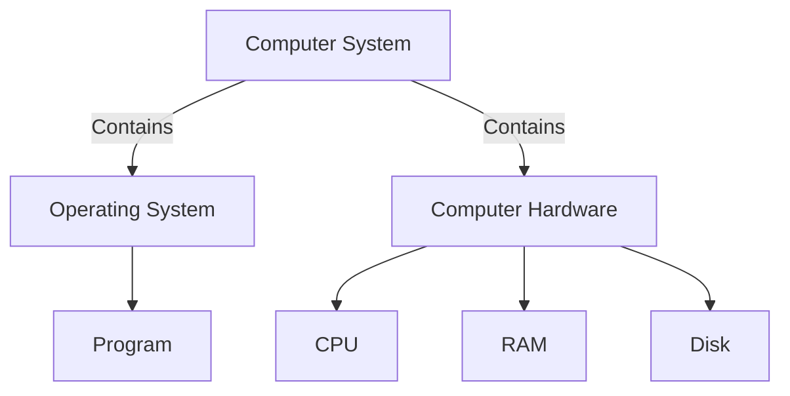

# What is a computer system

A **combination** of computer hardware and special system software that makes the computer usable

Main components:

- Input/Output (IO)
- Central Processing Unit (CPU)
- Random Access Memory (RAM)
- Secondary storage devices
- OS

We focus on computer systems that are **general purpose** (their function is not tailored to any specific application) and **reprogrammable** (they support running different program without modifying the hardware and software)

For such reasons, devices such as calculators are not categorized as a computer system (no OS and secondary storage) or microcontrollers (no OS)
