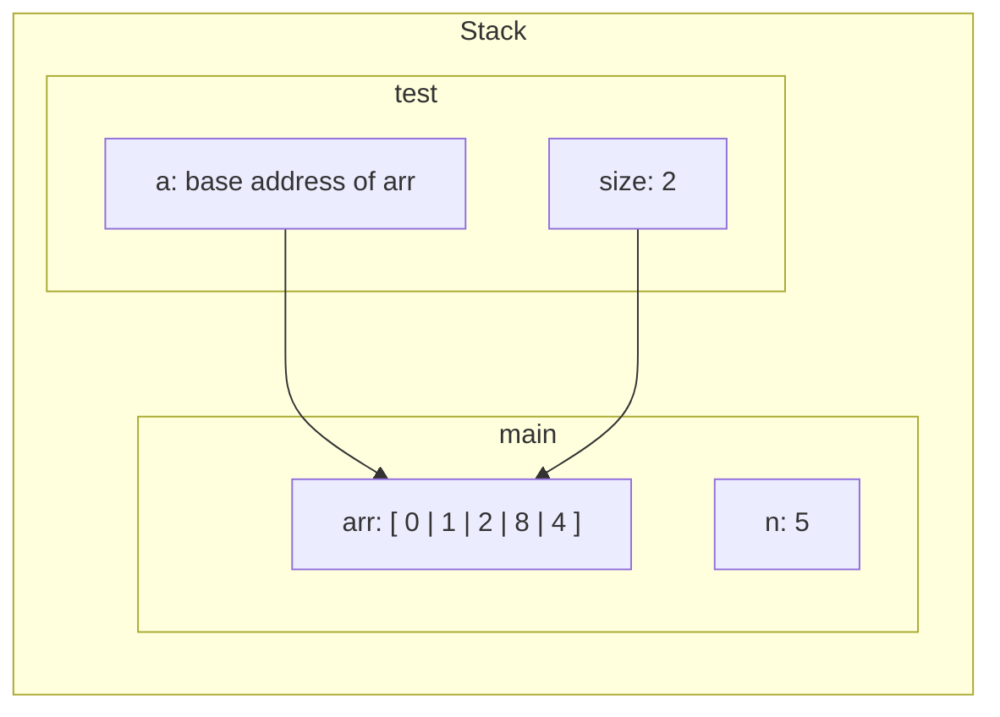

# 5-1-Arrays in C

C array is an **ordered collection of data elements of the same type**

The most basic form is a **one-dimensional array**

A **statically declared array** has the total capacity fixed and it is defined when the array variable is declared

In C we have to _specify the type and capacity at the point of variable declaration_ like `int arr[10];`

> [!IMPORTANT]
> C does not have `len()` function like Python, so the programmer has to _explicitly keep track of elements in the array_

## Array indexing

C dictates the array layout in program memory, whereas Python hides how lists are implemented from the programmer: In C, individual array elements are _allocated in consecutive locations_ in the program memory. For example, the 3rd array position is located in memory _immediately following the second array_

```
+------------+------------+------------+------------+------------+
| arr[0] | arr[1] | arr[2] | arr[3] | arr[4] |
+------------+------------+------------+------------+------------+
| Address A | Address A+4| Address A+8| Address A+12| Address A+16|
+------------+------------+------------+------------+------------+

```

Sometimes we declare an array with a capacity of `x` but only uses `y` with `x > y`. In that case, it is a good practice to _create a variable to keep track of the actual size_

```c
int i, num;
int arr[10];
 // declare an array of ints, with a capacity of 10
num = 6;
 // keep track of how many elements of arr are used
// initialize first 5 elements of arr (at indices 0-4)
for (i=0; i < 5; i++) {
  arr[i] = i * 2;
}
arr[5] = 100; // assign the element at index 5 the value 100
```

Also _it is up to the programmer to ensure only valid index values when indexing into arrays_. While Python will throw an error, invalid index values in C will lead to _unexpected program behaviors_

## Arrays and functions

Another good practice when passing arrays to functions is to _include the size of the array as the second parameter_

```c
// No capacity specifier in the array parameter here
// So it is better to explicitly specify the size
void print_array(int arr[], int size) {
  int i;

  for (i = 0; i < size; i++) {
    printf("%d\n", arr[i]);
  }
}

```

> [!IMPORTANT]
> An array parameter does not receive the array itself but **the value of the array's base address**. This means when a function modifies the elements of the array, the changes **will** persist when the function returns



Parameter `a` is passed the value of the **base address** of the array argument `arr`, which means _they both refer to the same set of array storage location_
