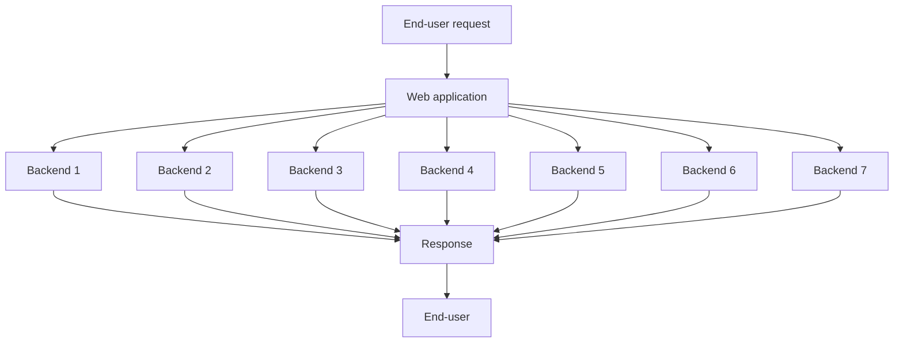

# Head-of-line blocking

Queueing delays often account for a large part of the response time at high percentiles aka the slowest requests. As computer systems can only handle a small number of things in parallel, only a small number of slow requests is needed to _stall the processing of subsequent requests_ aka **head-of-line blocking**

Even if subsequent requests are processed fast on the server, the client will still see a slow overall response time due to _the time waiting for the request to complete_. For this reason, it is important to _measure response time on the client side_

