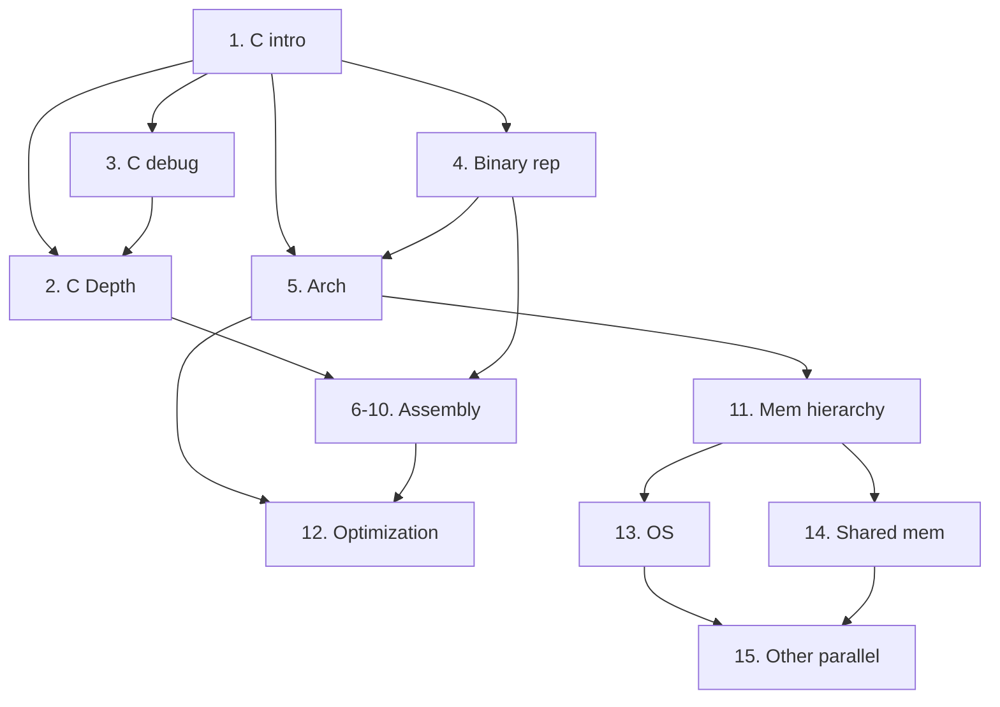

# Preface of Dive into Systems

## About this book

A **gentle** introduction into:

- C programming
- Architecture fundamentals
- Assembly language
- Multithreading

> [!TIP]
> We use the ocean metaphor here: Like modern life rises from the primordial ocean, modern programming rises from early computer architecture

> "As computing has wandered even further away from its machine-level origins, computer systems topics have often emerged as personal dragons for many computing students"

This book focuses on **CS1 knowledge** and it is designed to be a **first exposure** to many computer systems topics.
Chapters are written to be _as independent as possible_

## Ways to use this book

This book targets **intermediate-level courses** such as introduction to computer systems or computer organization. It can also be used for **upper-level courses** such as OS, compilers, parallel & distributed computing and computer architecture

This book is NOT designed to provide complete coverage of all system topics

