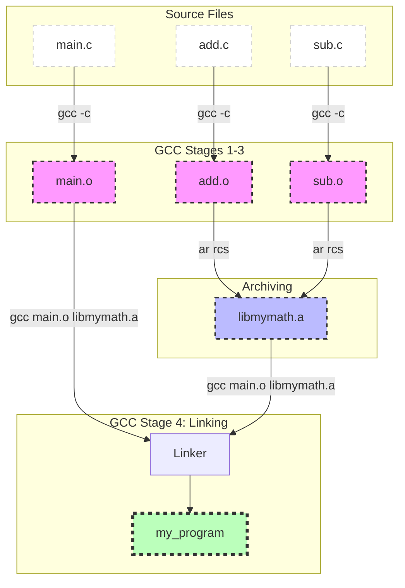

# Compiling C code

The C compiler translate the C source file `.c` to an executable binary file `.out` in four distinct steps: Precompiling -> Compiling -> Assembling -> Linking

[[Precompiling]]

[[Compiling]]

[[Assembling]]

[[Linking]]

[[Common compilation errors]]
